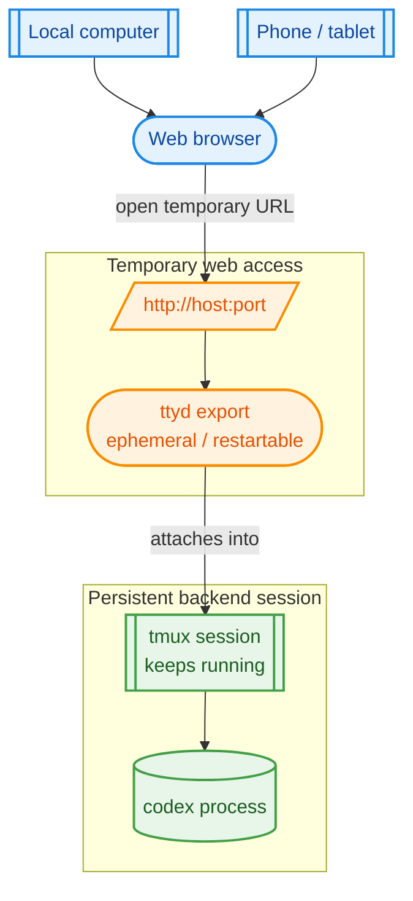

# agentmux

A tmux + ttyd launcher built around one core idea: keep your real work alive in tmux, then manage and reattach to it from your phone or browser when you're away from your desk.

`agentmux` turns running tmux sessions into temporary web terminals you can open from your phone, tablet, or browser over VPN/Tailscale. The point of the project is simple: ongoing projects should keep running inside persistent tmux sessions, while you get an easy way to check in, manage them, and jump back into them from the road without rebuilding your environment every time. It can also create and resume project sessions under `~/projects`, launch `codex` inside tmux, and reinitialize web access without touching the underlying tmux session.

## Project goal

`agentmux` is for the case where:

- your actual project session lives in tmux and keeps running
- you want quick phone access while traveling or away from your machine
- you want to attach from a web browser to ongoing projects without disturbing the underlying tmux session
- you care more about persistent project continuity than about keeping one browser tab alive

The key distinction is:

- the `tmux` session is the persistent thing
- the web URL is just a temporary `ttyd` attachment to that session

You can close the browser, let the URL expire, or restart web access without losing the underlying tmux session. If needed, `agentmux` can publish a fresh browser URL for the same already-running session later.



## What it does

- Puts persistent tmux sessions at the center of the workflow
- Makes it easy to manage those tmux sessions from your phone while on the road
- Lets you attach to ongoing projects from a web browser without losing session state
- Shows an arrow-key menu of running tmux sessions
- Exports a chosen tmux session over HTTP using `ttyd`
- Reuses an existing export for the same session when possible
- Picks the next free port if the preferred one is already taken
- Creates new project sessions under `~/projects/<name>`
- Runs `git init` automatically for project directories
- Starts `codex` for brand new projects
- Starts `codex resume` for existing project directories
- Attaches to existing project directories with a picker
- Stops or reinitializes only the web-export layer
- Keeps tmux and `codex` sessions persistent
- Uses running `ttyd` processes as the source of truth, with no temp state files

## Important behavior

- Think of `tmux` as the durable backend session, and `ttyd` as a disposable browser window into it.
- The timeout applies only to the **web export** (`ttyd`), not to tmux itself.
- Stopping web access never kills tmux or the `codex` process inside it.
- Reinitializing web access only restarts the browser-facing layer.
- Project sessions are persistent until you kill them yourself outside this script.
- The script listens on all interfaces by default, which works well with Tailscale.

## Requirements

Required tools:

- `bash`
- `tmux`
- `ttyd`
- `timeout` from GNU coreutils
- `git`
- `find`
- `ps`
- `awk`
- `grep`
- `sed`
- `hostname`

Optional but needed for project actions:

- `codex`

## Install

Clone the repo and make the script executable:

```bash
chmod +x agentmux.sh
```

You can then run it directly:

```bash
./agentmux.sh
```

Or choose a different starting port:

```bash
./agentmux.sh 9000
```

You can also override the web-export lifetime:

```bash
DURATION=8h ./agentmux.sh
```

Default values:

- base port: `7681`
- export duration: `6h`
- projects directory: `~/projects`

## Menu actions

### New project

Prompts for a project name.

Behavior:

- creates `~/projects/<name>` if it does not exist
- runs `git init` in that directory
- if the directory is new, starts tmux with `codex`
- if the directory already exists, starts tmux with `codex resume`
- exports the tmux session over HTTP

If a tmux session with the same project name already exists, the script will not create another session. It will show or reuse the existing web export for that tmux session.

### Attach to existing project

Shows a picker of directories inside `~/projects`.

Behavior:

- pick an existing project directory, or choose manual entry
- if a tmux session with that project name is already running, the script refuses to create another one
- if there is already a web export for that session, it prints the existing URL
- otherwise it starts a new tmux session in that directory with `codex resume`
- then it exports that tmux session over HTTP

### Stop existing export

Stops only the web-facing `ttyd` process for a chosen tmux session.

Behavior:

- tmux keeps running
- `codex` keeps running
- you can re-export the same session later

### Reinitialize web access

Restarts only the web export for a chosen tmux session.

Behavior:

- stops the current `ttyd` process for that session
- starts a fresh one on a free port
- tmux and `codex` stay alive the whole time

### Existing tmux session

Choosing a regular tmux session from the main menu will:

- print the existing export URL if one already exists, or
- start a new web export for that tmux session

## How export detection works

This project does **not** store state in `/tmp` or other cache files.

Instead, it inspects running `ttyd` processes and matches exports using the command line, specifically:

- `titleFixed=tmux:<session>`
- `tmux attach -t <session>`

That means the running `ttyd` processes themselves are treated as the source of truth.

## Scrolling and history

Browser scrollback is enabled through `ttyd`, and the script sets a larger browser-side scrollback buffer.

For better tmux history too, add this to your `~/.tmux.conf`:

```tmux
set -g history-limit 50000
set -g mouse on
```

## Typical workflow

1. Start or pick a tmux session with `agentmux`
2. Note the printed URL for the current web export
3. Open the URL from your phone over Tailscale or VPN when you're away from your desk
4. Close the browser whenever you want; the tmux session keeps running
5. Re-open the same URL later if that export is still alive, or use **Reinitialize web access** to get a fresh temporary URL for the same tmux session
6. Keep using the same underlying tmux session as the long-lived home for that ongoing project

## Example use cases

### Create a new project, then attach from a browser

1. Run `./agentmux.sh`
2. Choose **New project**
3. Enter a project name such as `my-app`
4. Let `agentmux` create `~/projects/my-app`, initialize git, start a tmux session, and launch `codex`
5. Copy or note the printed `http://...` URL
6. Open that URL in a web browser on your laptop, phone, or tablet

At that point, the browser is attached to the live tmux session for that project. That is the main point of `agentmux`: the browser attachment is temporary, but the ongoing project session in tmux is not. You can check in from your phone, close the browser tab, and come back later without stopping the underlying tmux or `codex` session.

Later, you can:

- open the same URL again if the export is still running
- use **Reinitialize web access** to get a fresh URL without restarting the project session
- attach locally with `tmux attach -t my-app` if you want to work outside the browser

### Attach to an existing project

You can also use `agentmux` with projects that already exist in `~/projects`.

1. Run `./agentmux.sh`
2. Choose **Attach to existing project**
3. Pick a directory from the list, or enter one manually
4. Let `agentmux` start or reuse the matching tmux session
5. Open the printed URL in your web browser

If that project already has a running tmux session, `agentmux` reuses that persistent session instead of creating a duplicate. If there is already a live web export for it, `agentmux` reuses that too; otherwise it can create a fresh temporary export for the same tmux session.

## Security

This script exposes a real interactive terminal over HTTP.

Recommended:

- keep it behind Tailscale or a VPN
- do not expose it directly to the public internet without authentication
- consider putting it behind a reverse proxy or access control layer if you need broader reachability

## Notes

- Session names and project names are limited to: `a-z A-Z 0-9 . _ -`
- The script is intentionally conservative about duplicate tmux sessions for the same project
- Killing tmux sessions is intentionally not handled by this script
